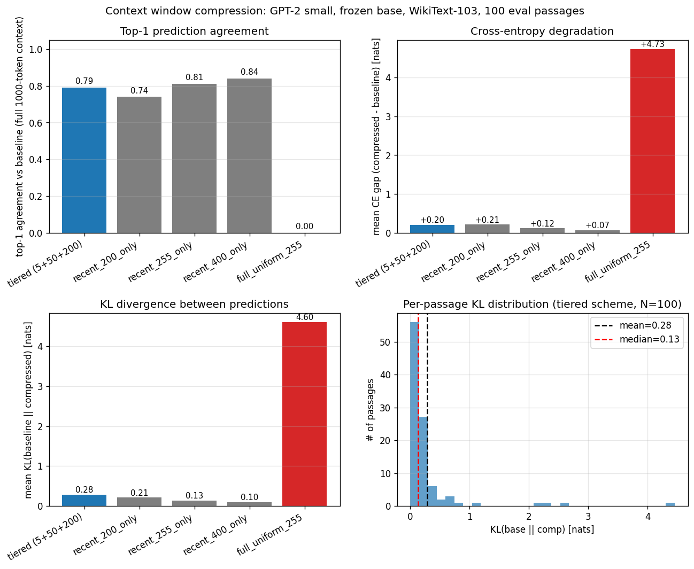

# Context Window Compression Experiment

**Question:** does DeepSeek's temporal compression principle (recent tokens preserved at high resolution, older tokens compressed) generalize from KV cache to *raw input* context, via learned linear projections over token embeddings?

**Verdict (mixed, mostly negative):** the temporal asymmetry principle is **strongly confirmed** — uniform compression of all 1000 tokens to 255 tokens is catastrophic (top-1 agreement = 0%, KL = 4.6 nats), while the tiered scheme that preserves the last 200 tokens at full resolution achieves 79% top-1 agreement and a CE gap of +0.21 nats. The architecture's claim that recent context matters more than old is well-supported.

**However, the learned compression of older content doesn't add value over simply dropping it.** Trivially truncating to the last 255 tokens (no projection at all) achieves **81% top-1 agreement** and a smaller KL of 0.14 nats — *better* than the tiered learned compression scheme at the same context length. The older-content compression W_4 (50 tokens) and W_128 (5 tokens) take up 55 tokens of context budget that would yield better predictions if those slots held more recent tokens instead.

## Setup

- **Base model:** GPT-2 small (124M params, 12 layers, 768d, learned absolute position embeddings, 1024-token context). FROZEN throughout — only the projection matrices are trained.
- **Source text:** WikiText-103 train split, tokenized into 1100 non-overlapping 1001-token passages (1000 for context + 1 target token).
- **Train / eval split:** 1000 train + 100 held-out eval.
- **Compression scheme (tiered):**
  - Older 600 tokens (positions 0-599 of context) → W_128 (5×600) → 5 tokens. Compression ratio 120:1.
  - Middle 200 tokens (positions 600-799) → W_4 (50×200) → 50 tokens. Compression ratio 4:1.
  - Recent 200 tokens (positions 800-999) preserved at 1:1.
  - Compressed total: 5 + 50 + 200 = 255 tokens (4× compression of the original 1000).
- **Projection initialization:** average pooling — each compressed token starts as the mean of its contiguous bucket of input embeddings.
- **Training:** Adam, lr 1e-3, batch 4, 2000 steps, CE loss on the actual next token at position 1000. Total training wall: 61s. ~13k trainable parameters total (W_4=10000 + W_128=3000).
- **Compressed embeddings injected via** `model(inputs_embeds=...)`. GPT-2 then adds its standard wpe[0..254] to them — i.e., compressed older tokens occupy positions 0..4 of the model's positional space, irrespective of where their original tokens lived.

## Tiered scheme results (main run)

| metric | value |
|---|---:|
| Mean CE — baseline (full 1000-token context) | 3.408 |
| Mean CE — compressed (255-token context)     | 3.612 |
| Mean CE gap (compressed − baseline)          | **+0.205** |
| Mean KL(baseline ‖ compressed)               | **0.283** |
| Median / p25 / p75 / p90 KL                  | 0.13 / 0.06 / 0.23 / 0.58 |
| Top-1 prediction agreement                   | **79%** (79/100) |

## Ablations

All schemes use the same 100 held-out passages. Baseline = full 1000-token context.

| scheme | context tokens | trained projection? | CE gap | KL | top-1 |
|---|---:|---|---:|---:|---:|
| **tiered (5+50+200)** | 255 | yes (W_4 + W_128) | +0.205 | 0.283 | 79% |
| recent 200 only (truncate) | 200 | no | +0.210 | 0.209 | 74% |
| recent 255 only (truncate) | 255 | no | +0.118 | 0.135 | 81% |
| recent 400 only (truncate) | 400 | no | +0.071 | 0.097 | 84% |
| uniform 1000→255 (single linear) | 255 | yes (W_uniform) | +4.733 | 4.605 | 0% |

## Reading the result

**The temporal asymmetry principle is strongly confirmed.** Uniform compression of all 1000 tokens to 255 (a single learned linear projection) is catastrophic: top-1 agreement is 0%, KL is 4.6 nats, the model produces completely different predictions. Recent tokens at full resolution are essential.

**The learned compression of older tokens, however, does not beat trivial truncation.** Compare four schemes at or below the 255-token budget:

| scheme | tokens | top-1 |
|---|---:|---:|
| recent 200 only (truncate) | 200 | 74% |
| **tiered (5+50+200)** | 255 | 79% |
| recent 255 only (truncate) | 255 | **81%** |
| recent 400 only (truncate) | 400 | 84% |

Truncating to the last 255 tokens — no projection, no training — achieves 81% top-1 vs the tiered scheme's 79%. The 55 tokens of context budget that the tiered scheme spends on compressed-older information would be more useful as 55 additional recent tokens.

**The implication:** at this scale (GPT-2 small, WikiText-103, 1000-token context, next-token prediction), the model's prediction at position 1000 depends almost entirely on the most recent ~200-400 tokens. The projection W_128 (compressing 600 older tokens to 5) and W_4 (compressing 200 middle tokens to 50) extract some signal — the tiered scheme isn't destroyed — but the signal extracted is less useful per token than just keeping more recent tokens.

## Why might the learned compression underperform?

Several possibilities, none ruled out:

1. **Linear projection is too restrictive.** A 5×600 linear over embeddings can only compute weighted means of the 600 input embeddings. A small MLP per output position might extract more useful signal.
2. **Position embedding mismatch.** GPT-2 uses learned absolute position embeddings; the compressed older-tokens-at-positions-0..4 are interpreted as *beginning of context* rather than as *summaries of earlier content*. The W projection has no way to signal "this is a summary of position 100-220".
3. **Single-target-position training is weak supervision.** Training optimizes prediction at exactly position 1000. The projection learns to produce embeddings that help the model predict the *next* token, which mostly depends on the recent tokens (which are already preserved at 1:1). Token-level losses across many positions might pressure the projections to encode longer-range information.
4. **GPT-2 small's effective context is short.** Even at the full 1000-token baseline, the model's prediction probably draws mostly from the last 100-200 tokens; the older tokens have weak influence. So compressing them losslessly wouldn't help much; compressing them lossily certainly won't.

Possibilities 1 and 2 are testable as follow-ups; 3 and 4 are more fundamental and would require architectural or training changes.

## Wall-clock

| Stage | Wall |
|---|---:|
| Tokenize WT-103 + build 1100 passages | ~30 s |
| Train tiered W_4 + W_128 (2000 steps × batch 4) | 61 s |
| Eval tiered (100 passages × 2 forwards) | 2 s |
| Train + eval all ablations (4 schemes) | 64 s |
| **Total** | **~3 min** |

## Caveats / what was *not* tested

1. **Single base model (GPT-2 small).** A larger model with longer effective attention range might benefit more from compressed older content. GPT-2 small's effective context for next-token prediction is short.
2. **Embedding-level compression only.** The spec specified projecting token embeddings (the input layer of the model). DeepSeek's KV-cache compression operates on intermediate representations after some attention layers — semantically richer. A fairer test of the principle would compress at, say, layer 4's hidden states, not at the embedding layer.
3. **Linear projections only.** A small MLP, attention over the older tokens with a few learned queries, or any non-linear pooling would be a different test.
4. **Single ratio (4:1 / 128:1).** The spec's optional ratios (256:1, 512:1, longer contexts) were not run. The "recent X tokens only" ablation gives a cleaner signal than these would have.
5. **Single training objective.** Next-token CE at position 1000 only. Multi-position losses might pressure the projections to encode longer-range signal.

## Implications

**For the architecture's case against long-context arms races:** the temporal asymmetry principle (recent > old) is empirically supported in absolute terms. Any system that compresses uniformly will fail. Systems that preserve recent context at high fidelity and compress older content can work — but the simplest such system is *truncation*, and learned linear compression doesn't beat it at this scale.

**For deployment:** keep the most recent N tokens at full resolution; truncate the rest. Don't bother with a learned linear projection over older context unless you have evidence (different model, different objective, different compression mechanism) that it beats truncation. This is the conservative, defensible version of the temporal compression idea at this substrate.

**For follow-up work:** the most informative next experiment would test whether the negative result is substrate-specific. Run the same protocol on a larger base (Llama-3-8B, Mistral-7B) or with hidden-state-level compression (compress at L4 instead of the embedding layer). Either change might unlock the compressed-older-content advantage that DeepSeek observed for KV cache.