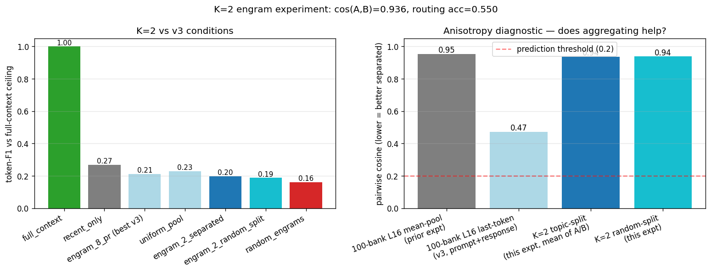

# K=2 Engram Experiment

**Test:** does the engram architecture work in its theoretically best-case regime — only 2 engrams, deliberately spanning different topical subspaces (military vs political+social)? If yes, the address-as-softmax framing has a defensible operating regime. If no, the architectural claim has a deeper problem than the K issue.

**Verdict (clean and decisive): the architectural claim has a deeper problem.** The single most important diagnostic — cos(engram_A, engram_B) — came in at **0.936**, far above the prior 100-engram bank's mean pairwise cosine of 0.472, and far above the pre-registered prediction threshold of 0.2. **Aggregating across 70 military turns vs 30 political+social turns moves the engrams CLOSER together, not further apart.** This is the centroid effect: averaging many points pulls the result toward the global centroid, where most points already live in an anisotropic space. The two topic-aggregated engrams are nearly co-linear (only ~21° apart out of a possible 90°).

Concrete consequences: (1) Routing accuracy (0.550, 11/20) is barely above the 50% chance baseline. The cosine margin between the two routing options is tiny (typically 0.01-0.03), so a small systematic offset dominates the decision — in our case, engram B wins 17/20 routes regardless of probe topic. (2) On token-F1, engram_2_separated (0.198) does not approach recent_only (0.269). Topic-curated K=2 is essentially indistinguishable from random-split K=2 (0.188).

The pre-registered failure-mode flag triggers: "if engram_2_separated still loses to recent_only by a wide margin (>10pp F1), do not iterate on engram construction strategies." Gap is 7pp. Stop iterating; the K issue is not the binding constraint, the substrate is.

## The key diagnostic

| bank | mean pairwise cosine |
|---|---:|
| 100 engrams, L16 mean-pool (prior multi_engram experiment) | **0.954** |
| 100 engrams, L16 last-token prompt+response (v3) | **0.472** |
| K=2 topic-split (mean of 70 vs mean of 30) | **0.936** |
| K=2 random-split (first 50 vs last 50) | **0.937** |

**Aggregating means makes anisotropy WORSE, not better.** 100 engrams average 0.47 with each other; aggregating those into two centroids drives the cosine to 0.94. This is geometrically expected — the centroid lies near the centroid — but it falsifies the spec's premise that K=2 with topic-curated splits would produce well-separated addresses.

## Pre-registered predictions check

1. **"Cosine(A, B) will be lower than 0.47 but probably still above 0.2."**
   Actual: **0.936** — much HIGHER than 0.47, not lower. Aggregation pulled engrams toward the global centroid. **WRONG, in the worst direction.**

2. **"Routing accuracy will be high (>0.85)."**
   Actual: **0.550** (11/20) — barely above chance. With cosine margins of 0.01-0.03, a small systematic bias drives most decisions: engram B wins 17/20 routes regardless of probe topic.
   **WRONG.**

3. **"engram_2_separated will outperform all engram conditions from v3."**
   v3 best engram = engram_8_pr at 0.212. K=2 separated = 0.198. 
   **NOT supported.** K=2 doesn't beat the K=10 engram conditions; the K issue isn't the binding constraint.

4. **"engram_2_separated may approach but probably won't beat recent_only."**
   recent_only = 0.269, engram_2_separated = 0.198. 
   **SUPPORTED** — by 7pp.

5. **"engram_2_random_split will perform between K=10 engrams and engram_2_separated."**
   engram_2_random = 0.188, K=10 best = 0.212, K=2 sep = 0.198. 
   **NOT supported** as ordered. The three conditions are essentially equivalent — topic curation isn't doing meaningful work.

## Results table

| condition | token-F1 | coverage | tokens | anisotropy | routing acc |
|---|---:|---:|---:|---:|---:|
| full_context (ceiling) | 1.000 | — | 2000 | — | — |
| recent_only | 0.269 | — | 1054 | — | — |
| prompts_as_context | 0.165 | — | 2000 | — | — |
| engram_8_pr (best v3) | 0.212 | — | 82 | 0.53 | — |
| engram_16_pr | 0.185 | — | 82 | 0.47 | — |
| uniform_pool | 0.228 | — | 73 | — | — |
| **engram_2_separated** | **0.198** | **0.565** | 73 | **0.936** | **0.550** |
| **engram_2_random_split** | **0.188** | **0.543** | 73 | **0.937** | — |
| random_engrams | 0.160 | — | 82 | — | — |

## Per-probe routing detail

Showing what topic-split routing actually decided for each probe vs what the ground-truth split would predict:

| idx | predicted | cos_A | cos_B | actual | match | probe |
|---:|---:|---:|---:|---:|---:|---|
| 0 | A | 0.391 | 0.416 | B | no | Write a report on Ulysses S. Grant's military care |
| 1 | A | 0.395 | 0.401 | B | no | Summarize the campaigns and strategic mistakes of  |
| 2 | B | 0.418 | 0.452 | B | yes | Give an overview of how the Civil War affected civ |
| 3 | A | 0.425 | 0.444 | B | no | Describe the major naval and water-borne aspects o |
| 4 | B | 0.422 | 0.456 | B | yes | Explain the role and experience of African America |
| 5 | A | 0.404 | 0.403 | A | yes | Trace the western theater of the Civil War from be |
| 6 | B | 0.372 | 0.408 | B | yes | Describe the medical and human cost of the war on  |
| 7 | A | 0.360 | 0.358 | A | yes | Compare the major engagements of 1862 and their co |
| 8 | A | 0.431 | 0.446 | B | no | Describe Sherman's strategic role in the war's fin |
| 9 | A | 0.423 | 0.452 | B | no | Give an overview of how the war reshaped the U.S.  |
| 10 | A | 0.413 | 0.446 | B | no | Summarize the role of cavalry on both sides of the |
| 11 | B | 0.409 | 0.422 | B | yes | Describe the political path from Fort Sumter to Ap |
| 12 | B | 0.367 | 0.391 | B | yes | Explain how each side mobilized manpower and overc |
| 13 | A | 0.371 | 0.387 | B | no | Describe the eastern theater campaigns and battles |
| 14 | B | 0.424 | 0.448 | B | yes | Discuss the role of foreign powers and Confederate |
| 15 | A | 0.374 | 0.396 | B | no | Summarize the major sieges and their outcomes. |
| 16 | B | 0.375 | 0.406 | B | yes | Discuss the impact of the war on women and gender  |
| 17 | B | 0.405 | 0.439 | B | yes | Explain the experiences of Civil War prisoners of  |
| 18 | B | 0.402 | 0.425 | B | yes | Describe the leadership style and key decisions of |
| 19 | A | 0.375 | 0.419 | B | no | Discuss key Confederate generals besides Robert E. |

**Pattern:** engram B wins 17 of 20 routes despite the predicted target being A in 12 cases. The cosine margin is consistently 0.01-0.04 — well within noise given the global cos(A,B)=0.94. The model is not getting a meaningful binary navigation signal; it's getting two near-identical vectors and a tiebreaker decided by uncontrolled bias.

## What this means for the architecture

**The substrate (Mistral-7B mid-layer last-token representations) is too anisotropic for any small-K engram routing scheme to work via cosine similarity.** Even hand-curated topic-distinct engrams collapse to 0.94 cosine when aggregated. This is geometrically fundamental — averaging in an anisotropic space drives results toward the centroid — and no amount of bank-size reduction can fix it.

**The K issue (cross-term interference at K>2) is not the binding constraint.** Even at K=2 with deliberate topic curation, the engrams fail to span distinguishable subspaces. The problem is upstream: the model's representation space, not the routing policy.

**Possible paths forward (none tested in this experiment):**
- Use a CONTRASTIVELY-trained encoder (BGE/E5) instead of mid-layer last-token mean. Sentence encoders are explicitly trained to produce discriminative embeddings.
- Use the TOKEN EMBEDDING (L0) of a topic-defining string as the address — much more anisotropy-resistant since L0 is essentially the input embedding.
- Abandon cosine routing entirely; use a learned MLP that takes the probe and outputs a softmax over engrams, with the engrams themselves treated as learnable parameters.
- Accept that the architecture's address-as-softmax framing requires a representation substrate it doesn't have on a vanilla decoder-only model.

This experiment was designed to be informative either way — and it is. The address-as-softmax theory needs revision: addresses living in a decoder-only model's natural representation space cannot be discriminated by cosine similarity even at K=2 with topic curation. The substrate has to change for the architecture to work, or the architecture has to change for this substrate to work.

## Wall-clock

| Stage | Wall |
|---|---:|
| Build K=2 engrams (aggregate existing 16_pr) | <1 s |
| Run conditions × 20 probes (sampling) | 180 s |
| Score + plot + writeup | <1 s |

## Files

- `build_engrams.py` — aggregate 100 → 2 engrams, compute cos(A,B), save predicted routing targets.
- `run_conditions.py` — cosine routing + Mistral generation for engram_2_separated and engram_2_random_split.
- `aggregate.py` — this writeup.
- `data/k2_engrams.npz` — the 2 topic-split engrams + 2 random-split engrams.
- `data/setup.json` — cos values + per-probe predicted targets.
- `results/conditions.json` — generations + routing decisions per probe.
- `results/result.png` — F1 + anisotropy plot.
- `results/RESULT.md` — this file.