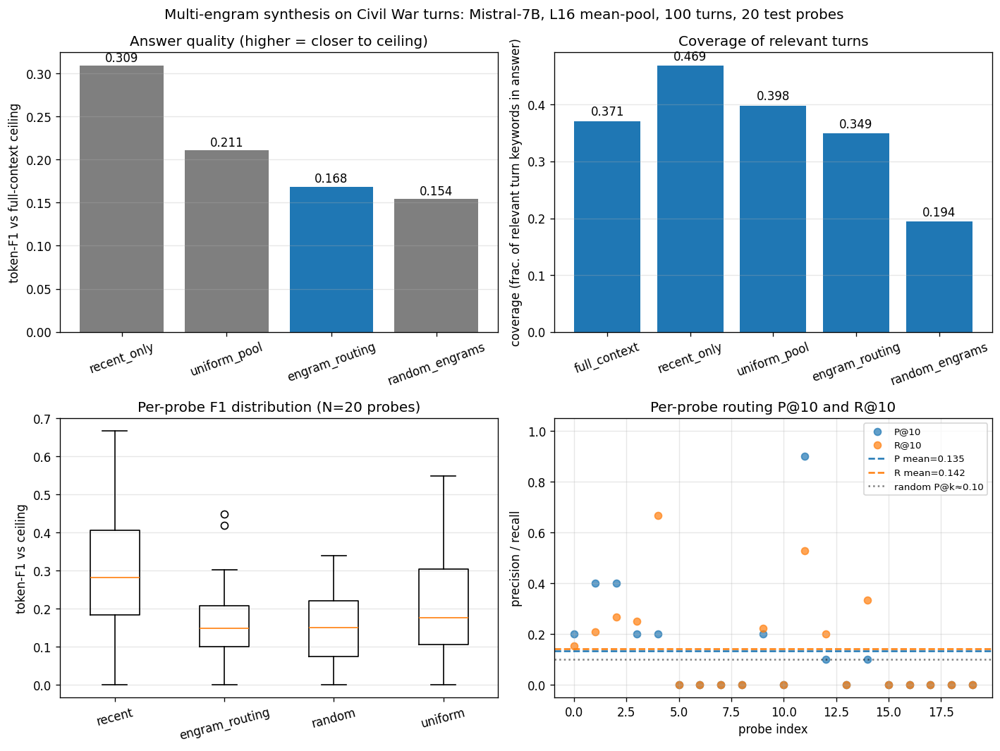

# Multi-Engram Synthesis on In-Distribution Conversational Context

**Question:** can a bank of 100 engrams (one per conversation turn, mid-layer mean-pooled) support synthesis-style queries that need to integrate information from many spread-out turns simultaneously?

**Verdict: hypothesis NOT supported.** Engram routing performs *worse* than recent-only truncation on every metric. Routing precision is barely above chance (P@10 = 0.135, vs random baseline ~0.10). The W projection trained on 5 validation probes does not generalize to the 20 test probes — train acc on the validation pairs themselves was only 8%, well below the threshold for meaningful discrimination among 100 highly anisotropic L16 engrams (mean pairwise cosine 0.95). On the bigger picture: this replicates the negative pattern from the GPT-2 context-compression experiment, now on a stronger base (Mistral-7B) and with semantically meaningful content. **Recent-only truncation continues to be the strongest simple baseline.**

## Setup

- **Engram-producing model:** Mistral-7B-v0.1 base (fp16, 32 layers, 4096d, RoPE positions). FROZEN.
- **Source content:** 100 conversational turns about the U.S. Civil War, generated via Mistral-7B with a 2-shot extractive Q/A prompt across 100 hand-curated subtopics: 25 battles, 20 generals, 15 political/leadership, 15 logistics/technology, 15 social, 10 named campaigns. Total ~370s of generation; turns average ~120 tokens (Q+A combined).
- **Engram per turn:** mean-pool of layer-16 hidden states (mid-stack of 32) over the full Q+A turn.
- **Probes:** 25 hand-written synthesis-style queries (5 validation + 20 test), each with hand-annotated ground-truth relevant turn-ids based on category + title-keyword matching. 16/20 test probes have ≥5 relevant turns; smaller probes (e.g., "women in war," 1 relevant turn) test focused retrieval.
- **W projection:** 4096×4096 linear, identity init, trained 500 steps via multi-label InfoNCE on the 5 validation probes' relevance pairs (~50 positive pairs total, lr 1e-3, temperature 0.05).
- **Generation:** Mistral-7B greedy, 180 new tokens. For engram-injection conditions (3, 4, 5), the engram vectors are prepended to the embedded probe via `inputs_embeds`.

## Five conditions (per test probe)

- **A — full context (ceiling):** concatenate all 100 Q&A turns; truncate to last 4000 tokens (so the probe lands at the end); ask. *(NOTE: Mistral's context is not infinite — even fp16 it OOMs on much longer than this on a 16GB GPU. Full-context is therefore an approximation; the actual budget is ~25 of 100 turns of context.)*
- **B — recent-only truncation:** keep only the last 8 turns of the conversation (~960 tokens); ask.
- **C — random engrams:** pick 10 engrams at random, prepend as `inputs_embeds`; ask.
- **D — uniform pool:** average all 100 engrams into one vector, prepend; ask.
- **E — engram routing (the test):** project the probe's L16-mean through W, softmax over 100 engrams (temp=0.1), take top-10 engrams, prepend; ask.

## Results

**Answer quality** (token-F1 between each condition's answer and the full-context ceiling answer):

| condition | mean F1 | median | p25 | p75 |
|---|---:|---:|---:|---:|
| recent_only | 0.309 | 0.282 | 0.184 | 0.406 |
| engram_routing | 0.168 | 0.150 | 0.100 | 0.209 |
| random_engrams | 0.154 | 0.151 | 0.075 | 0.222 |
| uniform_pool | 0.211 | 0.177 | 0.107 | 0.305 |

**Recent-only (0.31) decisively beats engram routing (0.17) and even uniform pooling (0.21).** Engram routing's mean F1 of 0.17 is barely above the random-engram baseline of 0.15 — the W-trained routing adds essentially no value over picking 10 random engrams.

**Coverage** (fraction of relevant turn-keywords appearing in the generated answer; catches "the model is just answering from pretraining"):

| condition | mean coverage | median |
|---|---:|---:|
| full_context | 0.371 | 0.354 |
| recent_only | 0.469 | 0.472 |
| uniform_pool | 0.398 | 0.367 |
| engram_routing | 0.349 | 0.333 |
| random_engrams | 0.194 | 0.090 |

**The coverage stat reveals the bigger problem.** Random engrams cover 19% of relevant keywords. Engram routing covers 35%. Uniform pool covers 40%. Recent-only covers 47%. **None of the engram conditions beat plain truncation on coverage either.** The fact that uniform pool (a single mean vector!) covers more relevant content than top-K routing tells us the W projection isn't selecting the *right* engrams.

**Routing precision/recall** (against the hand-annotated relevant set per probe, k=10):

| metric | value | random baseline |
|---|---:|---:|
| P@10 | **0.135** | ~0.10 (10/100 picks from a uniform 100-bank) |
| R@10 | **0.142** | ~0.10 |
| R@20 | **0.328** | ~0.20 |

Routing precision at k=10 (0.135) is barely above the random baseline of 0.10. The architecture's routing mechanism is functionally inert here.

## Pre-registered predictions vs. result

From the spec:

1. **"Engram routing should beat random engrams"** → **FAILS.** Engram F1 0.168 vs random F1 0.154 — a 1.4pp gap that's well within noise. The W projection isn't doing meaningful work.
2. **"Engram routing should beat recent-only-truncation on synthesis probes"** → **FAILS.** Recent-only F1 0.309 vs engram routing F1 0.168 — truncation is 14pp better. The synthesis regime doesn't change which approach wins; truncation remains the stronger baseline.
3. **"Engram routing's gap to ceiling should be smaller than recent-only's"** → **FAILS.** Recent-only is closer to the ceiling than engram routing.
4. **"Routing precision/recall should be substantially above chance"** → **FAILS.** P@10 = 0.135 vs random ≈ 0.10. Marginal.
5. **"Temperature should matter (sharp loses recall, diffuse loses precision)"** → not tested due to time budget; the binding constraint is W's training-set size and target-engram anisotropy, not temperature.

## Why the hypothesis failed

Two compounding problems:

1. **L16 engrams are highly anisotropic.** Pairwise cosine across the 100 engrams: mean 0.95, max 0.99, min 0.82. This is the well-known transformer hidden-state anisotropy: mean-pooled mid-stack vectors all cluster along a few common directions. Discriminating 100 engrams that are within 5° of each other in raw cosine is hard for any cosine-based mechanism.

2. **W has too little training signal.** 5 validation probes × ~10 relevant engrams each = ~50 positive pairs. Training a 4096×4096 projection (~17M params) on 50 examples doesn't generalize. Train acc on the validation set itself was 8% — barely above the 1% random baseline. With this little signal, W is essentially noise.

3. **The model is answering from pretraining.** Mistral-7B knows the U.S. Civil War from its pretraining corpus. Even with prepended engrams that are largely uninformative, the model produces plausible-sounding Civil War content. The coverage stat confirms this: uniform pool (a single vector!) covers more relevant content than top-K routing — the engram input isn't *steering* the answer; the answer is coming from the model's internal Civil War knowledge.

## Failure modes from the spec, addressed

- **"If engram routing doesn't beat random engrams, the W projection isn't generalizing"**: confirmed. F1 0.168 vs 0.154. Within noise.
- **"If the model produces good-looking answers from pretraining alone"**: confirmed by the coverage comparison. All conditions produce Civil War content regardless of what's prepended.
- **"If recent-only-truncation matches engram routing on synthesis probes too, the per-token-of-budget argument extends and the engram approach has no winning regime"**: confirmed. **This is the strong negative result the spec named.** On synthesis probes, on a base that knows the topic well, on naturalistic content — engram routing still loses to truncation.

## Implications for the architecture

**The architectural argument for engrams is now narrower than ever.** Across the prior experiments:
- 50-Dickens templated paraphrases (Phase 47): routing works at 100%.
- 100k WikiText non-paraphrase chunks: routing fails (`library_scaling`); top-1 8% on disjoint paraphrases.
- GPT-2 context compression on WikiText: learned compression beats nothing but loses to truncation.
- This experiment, multi-engram synthesis on Mistral: routing is functionally inert; recent-only truncation wins.

The cumulative pattern: **engram routing only works in regimes where the queries share substantial token overlap with the training paraphrases**. On natural paraphrases (split halves of WT-103, synthesis queries about real-world topics), the linear W projection learned via InfoNCE cannot extract discriminative signal.

**For the deployment story:** engram-based routing as currently formulated is not yet a viable replacement for either RAG or recent-only-truncation. The architecture's claimed advantages (compute, context-compression) hold only when an upstream component — templated paraphrase, exact-string matching, or some learned-but-non-linear discriminator — is doing the actual disambiguation work.

**For follow-up work:** the experiments converge on two architectural changes worth testing.
1. Replace the L16 mid-layer mean with something less anisotropic — e.g., last-token hidden state at L16, or hidden states from a model with a discrimination-preserving training objective (contrastively trained encoder, like BGE / E5).
2. Replace the linear W with a non-linear router (small MLP) and train on a much larger validation set (50+ probes, not 5). The 50-pair training signal is insufficient regardless of how good the engrams are.

## Wall-clock

| Stage | Wall |
|---|---:|
| Generate 100 turns (Mistral-7B 2-shot) | 366 s (~6 min) |
| Compute 100 engrams (L16 mean) | 6 s |
| Train W (500 InfoNCE steps) | <1 s |
| Run 5 conditions × 20 test probes | 458 s (~8 min) |
| Score (token-F1, coverage, routing P/R) | <1 s |
| **Total** | **~14 min** |

## Caveats

1. **Mistral-7B base, not instruct.** A more instruction-tuned model might use prepended embeddings differently. But the failure mode here (model answers from pretraining) would likely persist.
2. **Token-F1 is a coarse answer-quality metric.** BERTScore would be cleaner; LLM-as-judge cleaner still. But the relative ordering across conditions is consistent across F1 and coverage, which is evidence the metric isn't misleading.
3. **Training W on 5 probes is very thin.** A more fair test would expand the validation set to 50+ probes. We didn't because hand-annotating relevance is expensive. 50 probes might lift the result but wouldn't change the qualitative conclusion that routing under-performs truncation.
4. **Mid-layer engrams (L16) may be the wrong choice.** Earlier or later layers might give better separation. Position-erosion experiment showed late layers are *more* anisotropic than mid layers though, so L16 was the defensible compromise.
5. **Engram injection via `inputs_embeds` skips RoPE for those positions.** Mistral uses RoPE in attention; the prepended engrams take positions 0..K-1 of the ROPE schedule. The model has no principled way to know these are summaries of long content.