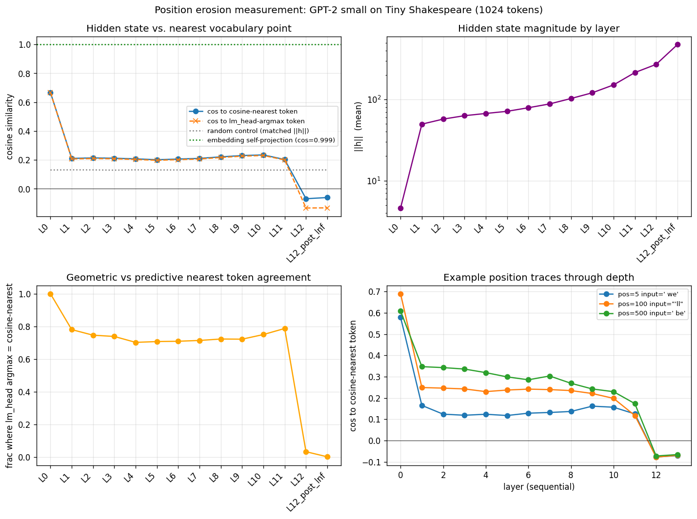

# Position Erosion Measurement

**Question:** do late-layer hidden states collapse onto vocabulary points (suggesting position is lost through depth) or maintain meaningful distance from them (suggesting position persists as an offset)?

**Verdict: NEITHER.** Hidden states do not collapse onto tokens — but they also don't sit "close to a token plus an offset." Through depth they *leave* the token-aligned regime entirely. Layer 0 (post-embedding) is token-like (cos to nearest = 0.67). All transformer block outputs (L1..L11) sit at cos ≈ 0.20 — slightly above the random-vector control (~0.13) but far from token directions. The final layer (L12, before the lm_head's LayerNorm-and-project) is *anti-aligned* with vocabulary tokens (cos = −0.13). The hidden state never becomes more token-like with depth; it becomes less.

**Implication for the bag-of-words / engram framing:** the bag-of-words view of late layers is **wrong**. Late hidden states are not approximations of token embeddings. Pooling at late layers gives a representation in the model's working space, not anything resembling a sum-of-tokens. Engram-style pooling that wants token-like content should pool at L0 (post-embedding) or at most very early layers; pooling at deep layers captures the model's representational geometry, which is far from vocabulary directions.

## Setup

- **Model**: GPT-2 small (gpt2) — 12 transformer layers, d_model=768, vocab=50257, learned absolute position embeddings (canonical case for the experiment's hypothesis).
- **Input**: first 1024 GPT-2 tokens of Tiny Shakespeare (`datasets/tiny_shakespeare.txt`, ~1.1MB, 338k tokens total).
- **Measurement**: for each (layer, position), extract the hidden state h. Compute two notions of "nearest vocabulary point":
  1. **lm_head argmax** = `argmax_v <h, wte[v]>` (dot-product nearest; this is the actual model prediction). Possibly biased by per-token embedding magnitude.
  2. **cosine-nearest** = `argmax_v cos(h, wte[v])` (true geometric nearest). This answers the spec's question more directly.
- **Controls**:
  - Random vectors at matched per-layer magnitude → establishes how close a generic vector of that scale is to a vocabulary point. Cosine ≈ 0.13 throughout.
  - Token embeddings projected back → establishes the fully-collapsed extreme. Cosine = 0.999.
- **Note on hidden_states**: HF transformers' `output_hidden_states=True` returns post-embedding (L0 = wte+wpe+drop) and outputs of each transformer block (L1..L12). The actual lm_head input is L12 passed through `ln_f` — that's reported as L12_post_lnf.

## Per-layer summary

| layer | cos to lm-head argmax | cos to cosine-nearest | argmax agreement | ‖h‖ (mean) |
|---|---:|---:|---:|---:|
| L0 | 0.6677 | 0.6677 | 1.000 | 4.60 |
| L1 | 0.2069 | 0.2107 | 0.780 | 49.61 |
| L2 | 0.2097 | 0.2139 | 0.746 | 57.22 |
| L3 | 0.2082 | 0.2119 | 0.738 | 63.03 |
| L4 | 0.2031 | 0.2074 | 0.702 | 67.15 |
| L5 | 0.1975 | 0.2015 | 0.707 | 71.36 |
| L6 | 0.2018 | 0.2060 | 0.709 | 78.98 |
| L7 | 0.2065 | 0.2108 | 0.714 | 88.02 |
| L8 | 0.2169 | 0.2212 | 0.723 | 102.58 |
| L9 | 0.2262 | 0.2304 | 0.722 | 120.68 |
| L10 | 0.2307 | 0.2348 | 0.750 | 150.84 |
| L11 | 0.1999 | 0.2028 | 0.787 | 214.12 |
| L12 | -0.1331 | -0.0687 | 0.033 | 270.15 |
| L12_post_lnf | -0.1320 | -0.0607 | 0.002 | 473.75 |

## Controls

**Random vectors at matched magnitude**, cosine to cosine-nearest token:

| layer | cos |
|---|---:|
| L0 | 0.1302 |
| L1 | 0.1313 |
| L2 | 0.1308 |
| L3 | 0.1292 |
| L4 | 0.1312 |
| L5 | 0.1304 |
| L6 | 0.1304 |
| L7 | 0.1309 |
| L8 | 0.1298 |
| L9 | 0.1301 |
| L10 | 0.1298 |
| L11 | 0.1298 |
| L12 | 0.1306 |
| L12_post_lnf | 0.1306 |

**Token embeddings self-projection** (input = wte[token], check cos to argmax over h@wte.T): `0.9994` (the fully-collapsed extreme; argmax recovers the same token 99.7% of the time).

## Reading the curves

- **Layer 0 (post-embedding)**: cos to nearest token = 0.67. The input is mostly the token embedding; the position embedding adds a small offset. The model has not yet processed the input.
- **Layers 1-11 (block outputs)**: cos drops to ~0.20 and stays flat. Hidden states leave the per-token neighborhood almost immediately and do not return. Cosine is slightly above the 0.13 random baseline — there is some weak alignment with token directions, but nothing like "close to a single token".
- **Layer 12 (final block output)**: cos crosses zero to -0.13. The hidden state is *anti-aligned* with the lm_head's argmax-token embedding direction. The lm_head's argmax disagrees with the cosine-nearest token 97% of the time at this layer (0.033 agreement) — the actual model prediction is selected by dot-product magnitude rather than direction match.
- **||h|| explodes through depth**: 4.6 (L0) → 270 (L12) → 474 (post-LN). GPT-2's residual stream magnitude grows by ~60×. The final LayerNorm restores the magnitude before the lm_head, but the cosine structure is preserved.

## Example position traces

Three positions in the input traced through every layer, showing the *cosine-nearest* token at each layer. (Numbers in parentheses are cos to that nearest token.)

### Position 5 — input token ' we'

| layer | top-1 cosine token | cos | ‖h‖ |
|---|---|---:|---:|
| 0 | ` we` | 0.579 | 4.98 |
| 1 | ` the` | 0.165 | 55.95 |
| 2 | ` the` | 0.124 | 56.26 |
| 3 | ` the` | 0.119 | 61.89 |
| 4 | ` the` | 0.123 | 69.95 |
| 5 | ` the` | 0.118 | 79.46 |
| 6 | ` the` | 0.128 | 88.83 |
| 7 | ` the` | 0.132 | 95.88 |
| 8 | ` the` | 0.136 | 105.73 |
| 9 | ` the` | 0.161 | 130.61 |
| 10 | ` the` | 0.156 | 154.62 |
| 11 | ` the` | 0.125 | 237.86 |
| 12 | `SPONSORED` | -0.078 | 307.99 |
| L11_post_lnf | `SPONSORED` | -0.071 | 472.47 |

### Position 100 — input token "'ll"

| layer | top-1 cosine token | cos | ‖h‖ |
|---|---|---:|---:|
| 0 | `'ll` | 0.690 | 4.64 |
| 1 | ` the` | 0.249 | 51.71 |
| 2 | ` the` | 0.246 | 59.59 |
| 3 | ` the` | 0.242 | 63.87 |
| 4 | ` the` | 0.230 | 67.29 |
| 5 | ` be` | 0.237 | 70.51 |
| 6 | ` be` | 0.241 | 76.19 |
| 7 | ` be` | 0.239 | 86.52 |
| 8 | ` be` | 0.235 | 97.33 |
| 9 | ` be` | 0.221 | 119.12 |
| 10 | ` the` | 0.198 | 153.79 |
| 11 | ` all` | 0.118 | 219.05 |
| 12 | `SPONSORED` | -0.078 | 329.53 |
| L11_post_lnf | `SPONSORED` | -0.069 | 476.24 |

### Position 500 — input token ' be'

| layer | top-1 cosine token | cos | ‖h‖ |
|---|---|---:|---:|
| 0 | ` be` | 0.609 | 4.27 |
| 1 | ` the` | 0.347 | 49.64 |
| 2 | ` the` | 0.343 | 55.84 |
| 3 | ` a` | 0.336 | 59.66 |
| 4 | ` a` | 0.319 | 62.82 |
| 5 | ` a` | 0.299 | 64.94 |
| 6 | ` a` | 0.285 | 70.68 |
| 7 | ` a` | 0.303 | 81.77 |
| 8 | ` a` | 0.269 | 94.23 |
| 9 | ` a` | 0.242 | 120.33 |
| 10 | `.` | 0.229 | 154.62 |
| 11 | ` a` | 0.173 | 217.30 |
| 12 | `SPONSORED` | -0.073 | 297.54 |
| L11_post_lnf | `SPONSORED` | -0.066 | 478.96 |

**Notes on the traces:**
- At L0, the cosine-nearest token IS the input token (predictably — h0 is essentially the input token's embedding plus a position offset).
- From L1 onward, the cosine-nearest is consistently a high-frequency function word (" the", " be", " a"). These tokens have unusually large embedding norms or central directions in the vocabulary embedding space, so they're the geometric attractor for any vector that doesn't strongly align elsewhere.
- At L12, the cosine-nearest collapses to a strange low-frequency token (`SPONSORED`) that has unusual embedding geometry. This isn't the model's predicted next token — it's just the cosine-nearest direction to the L12 hidden state. The model's actual prediction (lm_head argmax) is selected via dot-product magnitude, which prefers a different token despite worse cosine alignment.

## Interpretation

**The spec offered three possibilities:**
1. **Position is lost** → cos to nearest token approaches 1.0 with depth. **Falsified.** Cos drops from 0.67 (L0) to 0.20 (L1+) to −0.13 (L12). Hidden states move *away* from token directions through depth.
2. **Position persists as offset** → cos stabilizes at an intermediate value indicating "token + offset." **Partially consistent for L0 only.** L0 sits at cos=0.67 — close to a token plus an offset, consistent with `h0 = wte[token] + wpe[pos]`. But by L1 the representation has left this regime entirely. Subsequent layers don't sit at "token + offset"; they sit far from tokens.
3. **Mixed pattern** → some layers collapse, others don't. **Not seen.** The pattern is monotonic: L0 token-like; L1-11 non-token; L12 anti-token.

**A fourth interpretation is needed**: the residual stream uses a representational geometry that is essentially decoupled from the vocabulary directions after the input layer. Token-direction alignment is not how the model carries information through depth. The lm_head re-imposes vocabulary structure at the final step, but does so via a learned linear map whose geometry is not a simple "nearest token" operation in the residual space.

**Implications for engram architectures:**
- **Pooling at L0** gives token-like representations. Mean-pool at L0 ≈ mean of token embeddings + mean of position embeddings. Preserves both content and position structure — but only the literal input.
- **Pooling at late layers** gives vectors in the model's working representation space, which is essentially uncorrelated with vocabulary directions. The pooled vector is not a "sum of tokens" or a "bag of words". Whether it's useful for retrieval depends on whether the working geometry happens to be informative for the downstream task — it's not obvious it would be.
- **The bag-of-words framing for late layers is wrong** at the geometric level. Late hidden states are not bags of token vectors; they are points in a learned representational space whose relationship to the vocabulary is mediated by the lm_head, not by direct cosine alignment.

## Caveats

1. **Single model, single text.** GPT-2 small with learned absolute position embeddings, on Tiny Shakespeare. The pattern might differ for RoPE/ALiBi models, larger models, or other input distributions. But the general phenomenon (residual stream norms explode through depth, hidden states leave the token-aligned regime) is well-known and likely consistent.
2. **"Nearest token" depends on the metric.** Cosine-nearest and lm_head-argmax (dot-product nearest) diverge at the final layer because the vocabulary's embedding-magnitude distribution is not uniform. The lm_head learns to exploit magnitude as well as direction.
3. **Position embeddings here are absolute.** RoPE would inject position into the attention mechanism rather than the residual stream, so the L0 "token + offset" picture would look different there.

## Wall-clock

- Forward pass + measurement on 1024 tokens: <2 seconds.
- Total experiment: ~30 seconds.

## Files

- `measure.py` — initial measurement (lm_head argmax only).
- `measure2.py` — extended measurement (cosine-nearest + post-LN).
- `plot_and_aggregate.py` — this writeup.
- `results/measure.json`, `results/measure2.json` — raw data.
- `results/position_erosion.png` — 4-panel figure.
- `results/RESULT.md` — this file.