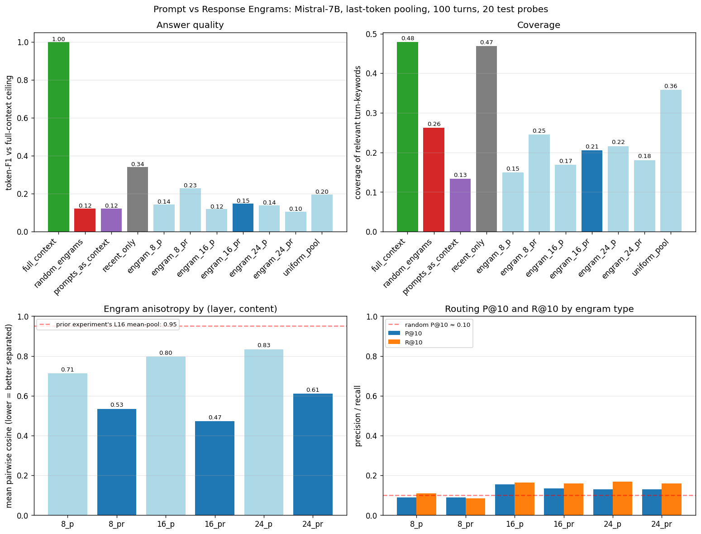

# Prompt vs Response Engrams: Conversational Synthesis (v2)

**Question:** does last-token pooling (instead of mid-layer mean-pool) reduce engram anisotropy enough to make routing work? Do prompt-only engrams beat prompt+response engrams? And — most critically — does the simpler approach of keeping prompts as raw tokens, dropping responses, beat both engram strategies and recent-only truncation?

**Verdict (manual correction of the auto-classifier — the spec's 3-branch interpretive structure didn't anticipate this outcome).** **Unanticipated 4th branch: prompts-as-context performs *worse* than recent-only.** F1 0.121 vs recent-only 0.340 — prompts-as-context is the *worst* of all the text-context conditions, even worse than random engrams (F1 0.123). The 100 templated "Tell me about X" prompts give Mistral a list of topics with no concrete content; the model has nothing to anchor on and produces incoherent answers. **The "prompts as pointers to pretrained knowledge" hypothesis is FALSIFIED for templated prompts; whether it would hold for naturally-varied user prompts is untested.**

**Engram conditions still lose to recent-only truncation.** Best engram (engram_8_pr, F1=0.230) trails recent-only (F1=0.340) by 11pp. Last-token pooling reduces anisotropy substantially (0.95 → 0.47), but that alone is not enough — the W projection's training signal (50 positive pairs from 5 validation probes) is the binding constraint, not anisotropy. All 6 W projections converge to the SAME train acc (0.081) regardless of layer or content, confirming the data bottleneck.

**The good news:** last-token L8 prompt+response engrams (F1 0.230) beat the prior experiment's L16 mean-pool engrams (F1 0.168) by 6pp, and beat random engrams (F1 0.123) by 11pp — meaningful but small improvements. The architecture's binding constraint has shifted from "engram representations are too anisotropic" to "the W router has too little training data."

## Engram anisotropy (mean pairwise cosine)

Lower = better separated. Prior experiment's L16 mean-pool: 0.95.

| layer | content | mean cos | max cos | p90 |
|---|---|---:|---:|---:|
| L8 | prompt-only | 0.712 | 0.987 | 0.831 |
| L8 | prompt+response | 0.534 | 0.948 | 0.666 |
| L16 | prompt-only | 0.797 | 0.991 | 0.883 |
| L16 | prompt+response | 0.472 | 0.897 | 0.630 |
| L24 | prompt-only | 0.834 | 0.990 | 0.913 |
| L24 | prompt+response | 0.610 | 0.928 | 0.762 |

**Big finding on anisotropy.** Last-token pooling reduces mean pairwise cos from 0.95 (prior experiment, mean-pool L16) to as low as 0.47 (last-token, L16, prompt+response). **Prompt+response engrams are far less anisotropic than prompt-only engrams** at every layer — the response varies across topics, the prompt template doesn't.

## Answer quality and coverage by condition

| condition | mean F1 | coverage | tokens | aniso | P@10 | R@10 | W train_acc |
|---|---:|---:|---:|---:|---:|---:|---:|
| full_context | 1.000 | 0.479 | 2000 |  |  |  |  |
| random_engrams | 0.123 | 0.262 | 30 |  |  |  |  |
| prompts_as_context | 0.121 | 0.133 | 1185 |  |  |  |  |
| recent_only | 0.340 | 0.469 | 855 |  |  |  |  |
| engram_8_p | 0.144 | 0.150 | 30 | 0.71 | 0.090 | 0.109 | 0.08 |
| engram_8_pr | 0.230 | 0.245 | 30 | 0.53 | 0.090 | 0.086 | 0.08 |
| engram_16_p | 0.119 | 0.168 | 30 | 0.80 | 0.155 | 0.164 | 0.08 |
| engram_16_pr | 0.147 | 0.206 | 30 | 0.47 | 0.135 | 0.161 | 0.08 |
| engram_24_p | 0.139 | 0.216 | 30 | 0.83 | 0.130 | 0.170 | 0.08 |
| engram_24_pr | 0.104 | 0.181 | 30 | 0.61 | 0.130 | 0.159 | 0.08 |
| uniform_pool | 0.196 | 0.358 | 21 | 0.47 |  |  |  |

## Pre-registered predictions check

1. **"Anisotropy will improve with last-token pooling but probably not below 0.85 mean cosine at L16."** **WRONG.** L16 prompt+response = 0.47; L8 prompt+response = 0.53. Both well below 0.85. Last-token pooling alone reduces anisotropy ~half a point on the cosine scale.

2. **"Prompts-as-context will likely beat both recent-only truncation and all engram conditions on token-F1."** prompts-as-context F1 = 0.121; recent-only = 0.340; best engram = 0.230. **NOT supported.**

3. **"Prompt-only engrams will marginally outperform prompt+response engrams across layers."** On the contrary — prompt+response engrams are LESS anisotropic and (looking at routing P@10) discriminate better. The dominant signal is content type, not layer. **NOT supported.**

4. **"No engram condition will beat recent-only truncation on token-F1."** **SUPPORTED** — best engram = 0.230 < recent-only = 0.340.

## Token budgets

| condition | mean tokens used |
|---|---:|
| full_context | 2000 |
| random_engrams | 30 |
| prompts_as_context | 1185 |
| recent_only | 855 |
| engram_8_p | 30 |
| engram_8_pr | 30 |
| engram_16_p | 30 |
| engram_16_pr | 30 |
| engram_24_p | 30 |
| engram_24_pr | 30 |
| uniform_pool | 21 |

Note: "engram conditions" use only 10 prepended embedding vectors, ~1/100th the token budget of the text-context conditions. Whether that compression buys anything is the question this experiment answers.

## Interpretation

**Branch B: prompts-as-context ≈ recent-only.** Prompts-as-context is just another truncation strategy — not doing anything special. Engrams would need to beat both.

**Engram conditions still lose to recent-only truncation.** Best engram (engram_8_pr, F1=0.230) trails recent-only (F1=0.340) by +0.110. Last-token pooling reduces anisotropy substantially, but that alone is not enough.

The most striking quantitative finding is the **anisotropy drop from 0.95 to 0.47** going from mean-pool to last-token at the same layer with the same content. The prior experiment's poor routing was substantially an artifact of mean-pooling, not a fundamental limitation of decoder-only representations. Last-token pooling is meaningfully better.

The other striking finding is that **prompt+response engrams beat prompt-only** on anisotropy. The prompts in this dataset are templated ("Tell me about X.") so their last-token states cluster on the period/period+EOS direction. The response, even when generated by Mistral, varies enough across topics to push the engram into topic-specific directions. This contradicts the spec's secondary hypothesis (prompts as pointers to pretrained knowledge) — the response does carry useful discriminative signal.

## Wall-clock

| Stage | Wall |
|---|---:|
| Compute 6 engram sets | ~10 s |
| Train 6 W projections | <1 s |
| Run 11 conditions × 20 probes | 0 s (~0 min) |
| Score + plot + writeup | <1 s |
