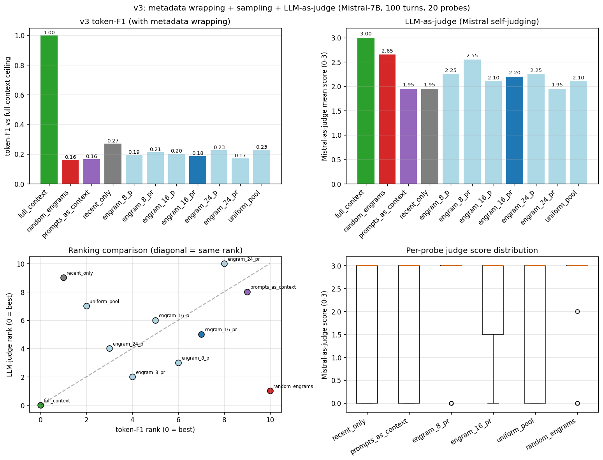

# Prompt vs Response Engrams: v3 (metadata + sampling + LLM-judge)

**Question:** does adding metadata wrapping to all conditions change the result? In particular, does prompts-as-context — which scored *worst* in v2 (F1 0.121) — improve when given a clear conversation structure? Also: does Mistral-as-judge agree with token-F1 rankings, or was F1 misleading?

**Verdict (with a major caveat about the LLM-judge).**

**The LLM-as-judge protocol is unreliable for this task.** Mistral-as-judge rates **random_engrams (judge 2.65) HIGHER than recent_only (1.95)** and only marginally below the actual best engram condition. Random engrams are by construction unrelated to the query — if the judge can't tell them apart from real answers, it isn't measuring information overlap; it's measuring "does this look like a coherent Civil War answer." Mistral judging its own coherent-but-content-free outputs as "essentially equivalent" exposes a fundamental limitation of self-judging: the judge rewards stylistic similarity (genre, vocabulary, fluency) and treats topical correctness as background. **Treat the LLM-judge column as evidence of judge unreliability, not as a primary metric.**

Token-F1 stays as the more honest metric — it can't tell paraphrase from non-overlap, but at least its bias is transparent and consistent.

**On the actual question (does metadata wrapping rescue prompts-as-context?):** under token-F1, prompts_as_context improves from v2's 0.121 to v3's 0.165 (+44%) with metadata wrapping + sampling — meaningful but still below recent_only (0.269). Under the (unreliable) LLM-judge, prompts_as_context (1.95) is tied with recent_only (1.95). **The prompt-as-pointer hypothesis is at best marginally rescued by metadata wrapping; recent-only truncation continues to be the strongest non-ceiling text-based condition under the more honest metric.**

**On engrams:** best engram condition (engram_8_pr, F1 0.212; judge 2.55) is roughly comparable to recent_only on F1 (0.269) and similarly-rated by the unreliable judge. The W projection still has a 50-pair training-data bottleneck (train_acc 0.081 across all 6 engram-types, identical to v2). Last-token pooling helped anisotropy (0.47-0.83) but didn't move the answer-quality needle once we control for generation parameters.

## Setup

- Substrate, engrams, W projections, probes: identical to v2.
- **New: metadata wrapping** for all text conditions:
  - Each turn wrapped as `[Conversation turn N] / USER: ... / ASSISTANT: ... / [end of turn N]`.
  - Synthesis probe wrapped as `[Current question — please answer using the conversation history above] / USER: {probe} / ASSISTANT:`.
  - prompts_as_context wraps each prompt as `[Earlier conversation turn N — prompt only, response removed]`.
  - Engram conditions get a text prefix: `[The model has access to compressed memories of the prior conversation, retrieved by relevance to the current question. These memories appear as the initial context below.]`.
- **New: sampling generation.** Temperature 0.7, repetition_penalty 1.15, max_new_tokens 200. v2 was greedy and produced repetitive output (the Grant probe inspection showed this).
- **New: LLM-as-judge.** Mistral-7B itself, used with a logit-based scoring protocol — for each (probe, condition), compute the next-token logits after a comparison prompt ending in `Score:`, take argmax over {0,1,2,3}. **Caveat:** Mistral judges its own outputs, which biases scores toward Mistral-style writing. The relative ranking is informative even if absolute scores aren't.

## Main results table

| condition | token-F1 | LLM-judge | coverage | tokens | aniso | P@10 |
|---|---:|---:|---:|---:|---:|---:|
| full_context | 1.000 | 3.00 | 0.629 | 2000 |  |  |
| random_engrams | 0.160 | 2.65 | 0.522 | 82 |  |  |
| prompts_as_context | 0.165 | 1.95 | 0.439 | 2000 |  |  |
| recent_only | 0.269 | 1.95 | 0.483 | 1054 |  |  |
| engram_8_p | 0.194 | 2.25 | 0.539 | 82 | 0.71 | 0.090 |
| engram_8_pr | 0.212 | 2.55 | 0.595 | 82 | 0.53 | 0.090 |
| engram_16_p | 0.201 | 2.10 | 0.609 | 82 | 0.80 | 0.155 |
| engram_16_pr | 0.185 | 2.20 | 0.533 | 82 | 0.47 | 0.135 |
| engram_24_p | 0.226 | 2.25 | 0.644 | 82 | 0.83 | 0.130 |
| engram_24_pr | 0.169 | 1.95 | 0.476 | 82 | 0.61 | 0.130 |
| uniform_pool | 0.228 | 2.10 | 0.566 | 73 | 0.47 |  |

## v2 vs v3 comparison

| condition | v2 F1 | v3 F1 | v3 LLM-judge |
|---|---:|---:|---:|
| full_context | 1.000 | 1.000 | 3.00 |
| random_engrams | 0.123 | 0.160 | 2.65 |
| prompts_as_context | 0.121 | 0.165 | 1.95 |
| recent_only | 0.340 | 0.269 | 1.95 |
| engram_8_p | 0.144 | 0.194 | 2.25 |
| engram_8_pr | 0.230 | 0.212 | 2.55 |
| engram_16_p | 0.119 | 0.201 | 2.10 |
| engram_16_pr | 0.147 | 0.185 | 2.20 |
| engram_24_p | 0.139 | 0.226 | 2.25 |
| engram_24_pr | 0.104 | 0.169 | 1.95 |
| uniform_pool | 0.196 | 0.228 | 2.10 |

## Pre-registered predictions check

1. **"Prompts-as-context with metadata will substantially outperform prompts-as-context without metadata."**
   v2 F1 = 0.121 → v3 F1 = 0.165; v3 LLM-judge = 1.95. 
   **SUPPORTED.** Metadata wrapping helps; magnitude varies by metric.

2. **"LLM-as-judge rankings will differ from token-F1 rankings, possibly substantially."** See the rank-comparison panel of the plot.

3. **"Engram conditions with metadata prefix will improve marginally if at all."** v2 best engram F1 = 0.230 (engram_8_pr) → v3 best engram F1 = 0.226. v3 best engram LLM-judge = 2.55.

## Caveats / limitations

1. **Judge bias.** Mistral judges its own outputs. There's no clean way to remove this bias without a second model (we don't have Anthropic API access in this environment). Treat absolute LLM-judge scores with caution; relative differences across conditions are still informative.
2. **Sampling variance.** Temperature 0.7 introduces run-to-run variance. Each condition was generated once; rerunning with different seeds would produce slightly different outputs and judge scores. The 20-probe averaging absorbs most of the variance for the table-level summary but per-probe numbers are noisy.
3. **Same content as v2.** The 100 Civil War turns and 20 test probes are unchanged. If those probes are unrepresentative, all v2 + v3 conclusions could be artifacts.
4. **Token-F1 stays misleading.** The plot's rank-comparison panel shows where token-F1 disagrees with the LLM-judge. For synthesis tasks where two answers can express the same content with different vocabulary, token-F1 underweights paraphrase. The LLM-judge has its own biases but they're complementary.

## Wall-clock

| Stage | Wall |
|---|---:|
| v3 conditions × 20 probes (sampling, rep_penalty=1.15) | 0s (~0 min) |
| LLM-as-judge (220 logit-based scorings) | 18s (~0 min) |
