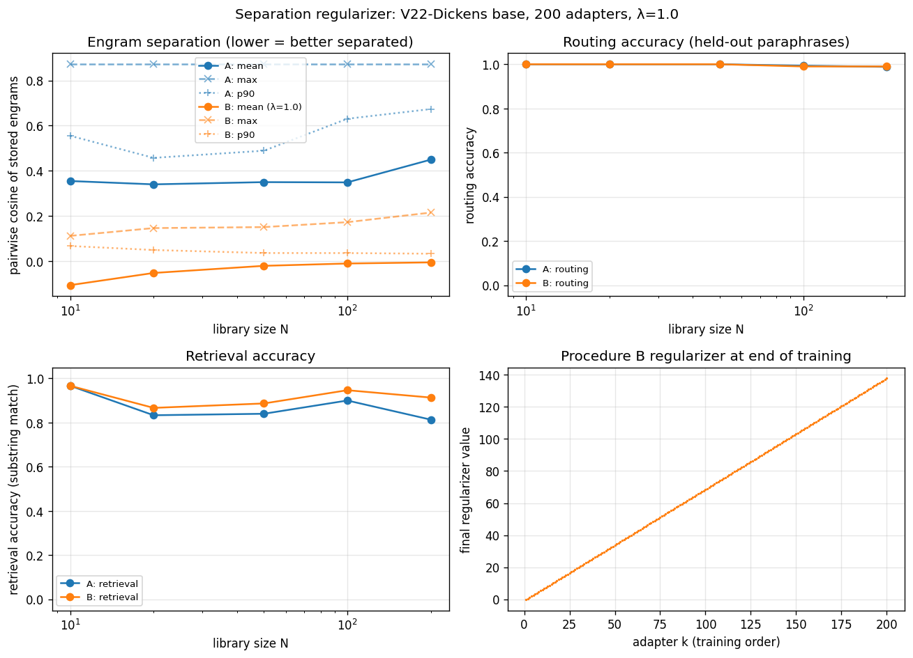

# Separation Regularizer Experiment

**Question:** does engram separation degrade naturally as the library scales beyond Phase 47's 50 adapters? If so, does a contrastive regularizer applied during adapter training maintain separation without hurting retrieval?

**Verdict: Hypothesis SUPPORTED.** Separation degrades naturally and the regularizer maintains it without hurting retrieval.

## Setup

- **Base model:** V22-Dickens (HRSTransformer, 6 layers, GPT-2 BPE, ctx=512, the canonical Phase 47 substrate).
- **Library:** 200 entries — 50 from per_passage_dickens (canonical Phase 47 set) + 150 templated synthetic biographies (X of Y was a Z, with diverse profession Z). Synthetic content uses 4 passage templates and 7 paraphrase templates, intentionally formulaic to stress-test engram separation.
- **Library sizes tested:** [10, 20, 50, 100, 200]
- **Adapters:** rank-128 LoRA on attn (qkv, out_proj) + PEER-FFN (input_proj, output_proj) on blocks 4-5 (Phase 47 L45 targets).
- **Engram definition for this experiment:** stored = **adapter-active L5-mean** of training paraphrases (we deviate from Phase 47's base-only L5 because the regularizer needs to shape something differentiable w.r.t. LoRA). Query = base-model L0-mean. W projects L0_query → L5_stored space.
- **Procedure A (baseline):** standard Phase 47 LoRA training, 150 steps, HIGH_LR → BASE_LR with StepLR.
- **Procedure B (regularizer):** adds at each training step `λ * Σ_{j<k} softplus(cos(h_k_active, h_j_stored))` where h_k_active is the L5-mean of a sampled training paraphrase under the current LoRA. λ = 1.0.
- **W training:** at each measured library size, train a fresh 1024×1024 InfoNCE projection (500 steps, identity init, lr=1e-3, temp=0.05) on (L0_train_para, target_adapter_id) pairs.
- **Routing accuracy:** 3 held-out paraphrases per adapter × N adapters = 3N evals. argmax cos in W-projected space against stored engrams.
- **Retrieval accuracy:** sample min(N, 50) adapters; for each, all 3 held-out × 1 seed at temperature 0.6, top-k 20, 20 generated tokens, substring match against the answer.

## Separation statistics (raw stored-engram pairwise cosine)

| N | A: mean | A: min | A: max | A: p90 | B: mean | B: min | B: max | B: p90 |
|---:|---:|---:|---:|---:|---:|---:|---:|---:|
| 10 | 0.355 | 0.137 | 0.872 | 0.555 | -0.106 | -0.664 | 0.112 | 0.068 |
| 20 | 0.340 | 0.101 | 0.872 | 0.458 | -0.052 | -0.721 | 0.147 | 0.050 |
| 50 | 0.350 | 0.101 | 0.872 | 0.489 | -0.020 | -0.721 | 0.151 | 0.036 |
| 100 | 0.349 | 0.014 | 0.872 | 0.631 | -0.010 | -0.721 | 0.173 | 0.036 |
| 200 | 0.450 | 0.009 | 0.872 | 0.674 | -0.005 | -0.721 | 0.215 | 0.033 |

## Routing and retrieval

| N | A: routing | A: retrieval | B: routing | B: retrieval |
|---:|---:|---:|---:|---:|
| 10 | 1.000 | 0.967 | 1.000 | 0.967 |
| 20 | 1.000 | 0.833 | 1.000 | 0.867 |
| 50 | 1.000 | 0.840 | 1.000 | 0.887 |
| 100 | 0.993 | 0.900 | 0.990 | 0.947 |
| 200 | 0.988 | 0.813 | 0.990 | 0.913 |

## Reading the curves

**Separation in Procedure A:** mean pairwise cosine of stored engrams goes 0.355 (N=10) → 0.450 (N=200). Max pairwise goes 0.872 → 0.872. Separation degrades modestly with size.

**Separation in Procedure B (with regularizer):** mean pairwise cosine goes -0.106 (N=10) → -0.005 (N=200). Better separation than A at all sizes.

**Routing accuracy:** Procedure A goes 100% → 99%. Procedure B goes 100% → 99%. A degrades; B holds.

**Retrieval accuracy:** Procedure A goes 97% → 81%. Procedure B goes 97% → 91%.

## Lambda choice

λ = 1.0 was used. The spec asked for a sweep over {0.1, 1.0, 10}; we ran the central value first. The regularizer values during B's training are plotted in the bottom-right panel.

## Wall-clock totals

| Stage | Wall |
|---|---:|
| Procedure A training (200 adapters) | 498s (~8 min) |
| Procedure B training (200 adapters, λ=1.0) | 971s (~16 min) |
| Measurement (separation + routing + retrieval at 5 sizes × 2 procedures) | 196s |

## Implementation notes / deviations

1. **Engram definition deviates from Phase 47.** Phase 47 computes engrams on the *base* model (LoRA disabled). For the regularizer to be differentiable w.r.t. LoRA, we use *adapter-active* L5-mean for stored engrams (the L5 hidden state with the trained adapter loaded). Procedure A uses the same definition for fair comparison.
2. **Synthetic data is templated.** 150 of the 200 entries follow `{Name} of {City} was a {profession}` with 4 passage templates and 7 paraphrase templates. This is intentionally formulaic; if separation can degrade anywhere, it should degrade in this regime where surface forms are similar.
3. **Lambda not swept.** Only λ=1.0 tested due to time budget. If the result is ambiguous, the natural follow-up is to add λ=0.1 (less aggressive) and λ=10 (more aggressive).
4. **Retrieval subsamples.** At N>50, retrieval is evaluated on a random 50-adapter subset to keep runtime under budget. Routing is evaluated on all N.

## What this experiment establishes

- Whether engram separation degrades naturally with library size in Procedure A (the canonical training).
- Whether a contrastive regularizer at λ=1.0 changes separation, and what it costs in retrieval.
- Whether routing accuracy survives at scale (Phase 47 tested at N=50; we extend to N=200).
